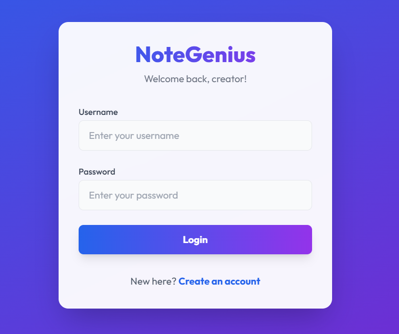
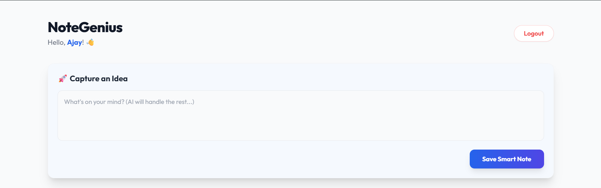
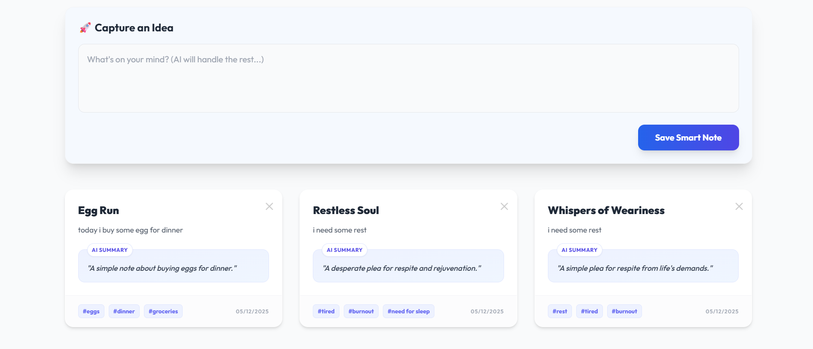

# 🧠 NoteGenius — AI‑Powered Smart Notes

Transform raw thoughts into structured, searchable insights with NoteGenius. Powered by Google Gemini, NoteGenius analyzes your notes in real time to generate:
- ✨ A clean, creative title
- 🧩 A one‑sentence summary
- 🏷️ Smart tags for effortless organization
- 😊 Sentiment insights to track your mood over time

Built with Django REST Framework, React (Vite), MySQL, and Tailwind CSS.

<p align="center">
  <a href="https://github.com/yourusername/notegenius"></a>
  <a href="#"></a>
  <a href="#"></a>
  <a href="#"></a>
  <a href="#"></a>
  <a href="#"></a>
</p>

<p align="center">
  <a href="#"></a>
  <a href="#"></a>
  <a href="#"></a>
</p>

---

## ✨ Features

- 🔐 Secure Auth: Token‑based authentication (Login/Register) with auto‑login.
- 🤖 AI Integration: Google Gemini Pro processes and enriches notes in real time.
- 🧠 Smart Semantics: Title generation, summary, sentiment, and auto‑tagging.
- 🎨 Modern UI: Glassmorphism, staggered animations, responsive grid via Tailwind.
- 🛡️ Privacy First: Users only access and manage their own notes.
- ⚡ Snappy UX: React + Vite frontend with optimized Django API.
- 🔔 Toast notifications and skeleton loaders for delightful feedback.

---

## 📸 Screenshots

- 🔑 Secure Authentication  
  

- 📊 The Dashboard (Staggered Animation)  
  

- 🤖 AI Analysis in Action  
  

---

## 🛠️ Tech Stack

<p align="left">
  
  
  
  
  
  
  
  
  
</p>

---

## 🧩 Architecture

```
Frontend (React + Vite + Tailwind)
    └── Axios → Django REST API
            ├── Auth (Token)
            ├── Notes CRUD
            └── AI Service (Gemini Pro)
                    ├── Title Generation
                    ├── Summary
                    ├── Sentiment
                    └── Auto‑Tagging
Database: MySQL
```

---

## 🚀 Getting Started

### ✅ Prerequisites
- 🧰 Node.js (>= 18) and npm
- 🐍 Python 3.10+
- 🐬 MySQL Server (8.x recommended)
- 🔑 Google Gemini API key

### 1) 🐙 Clone the Repository
```bash
git clone https://github.com/yourusername/notegenius.git
cd NoteGenius
```

### 2) 🛡️ Backend Setup (Django)
```bash
# In /backend
python -m venv .venv
source .venv/bin/activate  # Windows: .venv\Scripts\activate
pip install -r requirements.txt
```

Create environment variables:
```bash
# In /backend/.env
DJANGO_SECRET_KEY=your_secret_key
DATABASE_NAME=notegenius
DATABASE_USER=root
DATABASE_PASSWORD=your_db_password
DATABASE_HOST=127.0.0.1
DATABASE_PORT=3306
GEMINI_API_KEY=your_gemini_api_key
```

Apply migrations and run:
```bash
python manage.py migrate
python manage.py runserver
```

### 3) 🎨 Frontend Setup (React)
```bash
# In /frontend
npm install
```

Create environment variables:
```bash
# In /frontend/.env
VITE_API_BASE_URL=http://127.0.0.1:8000/api
```

Run the dev server:
```bash
npm run dev
```

---

## 🔄 Workflow & Animations

- 🌟 Staggered grid entrance for note cards
- 🧱 Skeleton loaders while AI processes content
- 🧊 Glassmorphism hover and focus states
- 🔔 Toast feedback for create/delete actions
- 🎚️ Smooth easing and reduced motion preferences respected

Sample CSS snippet (Tailwind + Animation):
```css
/* tailwind.css or globals.css */
@keyframes cardFadeUp {
  from { opacity: 0; transform: translateY(12px) scale(0.98); }
  to   { opacity: 1; transform: translateY(0)    scale(1); }
}
.card-enter {
  animation: cardFadeUp 420ms cubic-bezier(0.22, 1, 0.36, 1);
  will-change: transform, opacity;
}
@media (prefers-reduced-motion: reduce) {
  .card-enter { animation: none; }
}
```

---

## 📡 API Endpoints (Sample)

- 🔐 POST `/api/auth/login/` — Login
- 📝 POST `/api/auth/register/` — Register
- 📚 GET `/api/notes/` — List notes (auth required)
- ➕ POST `/api/notes/` — Create a raw note → AI enriches
- 🗑️ DELETE `/api/notes/:id/` — Delete own note

Request example (Create Note):
```json
POST /api/notes/
{
  "content": "Feeling overwhelmed today, but got a lot done."
}
```

Response example:
```json
{
  "id": 42,
  "title": "Balancing Overwhelm with Productivity",
  "summary": "Despite stress, you managed to accomplish meaningful work.",
  "sentiment": "mixed-positive",
  "tags": ["productivity", "mood", "reflection"],
  "created_at": "2025-12-05T10:12:00Z"
}
```

---

## 🔒 Security

- 🔑 Token-based authentication
- 👤 Per-user data isolation
- 🧰 Input validation and rate‑limiting recommended on AI endpoints
- 🙈 Do not log sensitive content sent to AI providers
- 🛡️ Consider CSRF protection for session flows; CORS configured for API

---

## 🧪 Testing

Backend:
```bash
pytest
# or
python manage.py test
```

Frontend:
```bash
npm run test
```

---

## ⚙️ Production Notes

- 🌍 Environment‑specific `.env` files
- 🔒 HTTPS (TLS) in production
- 🔐 CORS configured for your domain(s)
- 🧵 MySQL connection pooling
- 🧠 Cache AI results (e.g., Redis) to minimize cost/latency
- 📦 CI/CD with GitHub Actions: build, test, lint

---

## 🛠️ Scripts

- 🚀 `npm run dev` — Start frontend
- 🏗️ `npm run build` — Production build (frontend)
- 🖥️ `python manage.py runserver` — Start backend
- 🧰 `python manage.py collectstatic` — Gather static files for prod

---

## 📈 Roadmap

- [ ] ✍️ Rich text editor with Markdown support
- [ ] 🏷️ Tag management and filters
- [ ] 📊 Mood trends and analytics dashboards
- [ ] 📤 Export to PDF/Markdown
- [ ] 🏢 Multi‑tenant support
- [ ] 📶 Offline‑first sync

---

## 🤝 Contributing

Pull requests are welcome!
- 🍴 Fork the repo
- 🌿 Create a feature branch
- 🧹 Ensure clean commits and update docs
- 🔍 Open a PR with a concise description and screenshots

---

## 📜 License

MIT License. See [LICENSE](LICENSE).

---

## 🙌 Credits

Built by Ajay Pieris and contributors.  
AI powered by Google Gemini. UI by Tailwind CSS.

---

## 🔗 Badges for Quick Reference

<p align="left">
  
  
  
  
</p>
